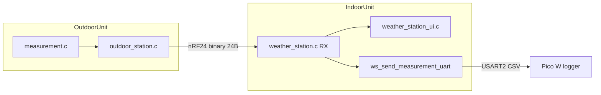
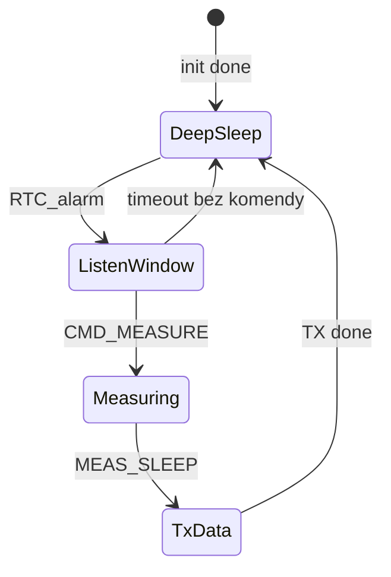
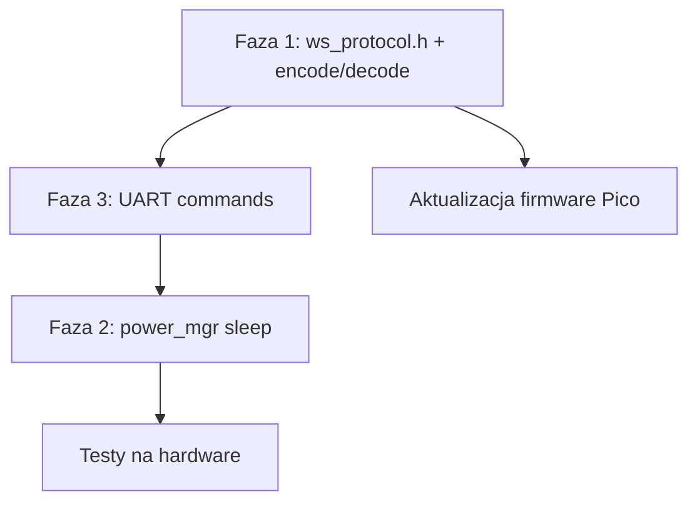

# Plan modernizacji Weather Station

## Stan obecny (ważna korekta)

`OutdoorStation_SendMeasurementData()` w [`OutdoorUnit/Core/Src/outdoor_station.c`](OutdoorUnit/Core/Src/outdoor_station.c) **nie wysyła CSV** — wysyła binarną strukturę `Measurement_Data_t` (24 B) przez nRF24:

```471:488:OutdoorUnit/Core/Src/outdoor_station.c
static void OutdoorStation_SendMeasurementData(void)
{
  Measurement_GetData(&measCtx, &txData);
  ...
  NRF24_WritePayload(&nrf, (uint8_t *)&txData, sizeof(Measurement_Data_t));
```

CSV jest używane tylko na ścieżce **IndoorUnit → Pico W** w [`ws_send_measurement_uart()`](IndoorUnit/Core/Src/weather_station.c) (linia `DATA:...S%u,temp,hum,...`). Funkcja `Measurement_GetCSV()` na OutdoorUnit istnieje, ale **nie jest nigdzie wywoływana**.

Obie strony muszą mieć identyczny layout payloadu — dziś to sztywna struktura z 5 polami `float` + `sensorStatus`, co wymusza ten sam zestaw czujników na każdej stacji.



---

## Faza 1 — Wspólny protokół pomiarów z kodami czujników

### Cel
Stacja może wysłać **dowolny podzbiór** odczytów; odbiorca rozpoznaje je po stałych kodach, bez zakładania identycznego hardware'u.

### Proponowany format (mieści się w limicie nRF24 = 32 B)

Nowy plik współdzielony: [`Common/include/ws_protocol.h`](/home/tepe/programowanie/stm32/Weather-Station/Common/include/ws_protocol.h) (+ opcjonalnie `ws_protocol.c` z encode/decode).

**Nagłówek (3 B):**
| Pole | Rozmiar | Opis |
|------|---------|------|
| `version` | 1 | `0x01` |
| `sensor_status` | 1 | bitmask błędów (zachować semantykę `ERROR_SI7021/BMP280/TSL2561`) |
| `count` | 1 | liczba rekordów (max 5 przy floatach) |

**Rekord (5 B):**
| Pole | Rozmiar | Opis |
|------|---------|------|
| `channel_id` | 1 | stały kod łączący czujnik + wielkość fizyczną |
| `value` | 4 | `float` (ten sam ABI co dziś) |

**Stałe kody `channel_id` (przykład):**
- `0x01` SI7021 temperatura
- `0x02` SI7021 wilgotność
- `0x03` BMP280 temperatura
- `0x04` BMP280 ciśnienie
- `0x05` TSL2561 lux
- `0x80+` rezerwa na przyszłe czujniki (np. wiatr, deszcz)

Maks. payload: `3 + 5×5 = 28 B` — mieści się w 32 B bez zmiany konfiguracji radia.

### Zmiany w OutdoorUnit

| Plik | Zmiana |
|------|--------|
| [`measurement.h`](OutdoorUnit/Core/Inc/measurement.h) | Zastąpić `Measurement_Data_t` tablicą odczytów lub cienkim wrapperem; dodać `Measurement_BuildPayload()` |
| [`measurement.c`](OutdoorUnit/Core/Src/measurement.c) | Po odczycie czujników budować listę rekordów tylko dla zainicjalizowanych sensorów; usunąć/zastąpić `Measurement_GetCSV()` |
| [`outdoor_station.c`](OutdoorUnit/Core/Src/outdoor_station.c) | `OutdoorStation_SendMeasurementData()` wysyła zakodowany bufor zamiast `sizeof(Measurement_Data_t)` |
| [`measurement_unit_config.h`](OutdoorUnit/Core/Inc/measurement_unit_config.h) | `NRF_PAYLOAD_SIZE` → `WS_PROTOCOL_MAX_PAYLOAD` (28 lub 32) |

Konfiguracja per-stacja: w [`measurement_unit_config.h`](OutdoorUnit/Core/Inc/measurement_unit_config.h) lista `ENABLED_CHANNELS[]` — każda stacja definiuje swój zestaw czujników bez zmiany kodu odbiorcy.

### Zmiany w IndoorUnit

| Plik | Zmiana |
|------|--------|
| [`weather_station.h`](IndoorUnit/Core/Inc/weather_station.h) | `WS_MeasurementData_t` → `WS_NodeReadings_t` (np. `count` + `WS_Reading_t readings[WS_MAX_READINGS]`) + helper `ws_reading_get(channel_id)` |
| [`weather_station.c`](IndoorUnit/Core/Src/weather_station.c) | `ws_handle_irq()` dekoduje payload; `ws_send_measurement_uart()` emituje **tagowany** format |
| [`weather_station_ui.c`](IndoorUnit/Core/Src/weather_station_ui.c) | UI/charts korzystają z `ws_reading_get()` zamiast bezpośrednich pól `si7021_temp` itd. |
| [`weather_station_config.h`](IndoorUnit/Core/Inc/weather_station_config.h) | Zaktualizować `NRF_PAYLOAD_SIZE` |

### Nowy format UART do Pico (breaking change)

Zamiast sztywnych kolumn CSV:

```
DATA:2026-05-09T11:06:01,S0,01:23.45,02:65.20,04:1013.25,05:120.5,OK\n
```

- `01`, `02`… = `channel_id` w hex
- status na końcu (zachować czytelność dla loggera)
- dokumentacja protokołu w komentarzu w `ws_protocol.h` (dla firmware Pico)

**Zewnętrzna zależność:** firmware Pico W (poza repo) musi zostać zaktualizowany równolegle.

### Weryfikacja Fazy 1
- Outdoor z 2 czujnikami wysyła `count=3`, Indoor poprawnie wyświetla brakujące wartości jako „--”
- UART do Pico loguje tylko obecne kanały
- Oba projekty kompilują się z tym samym `ws_protocol.h`

---

## Faza 2 — Niskie pobory energii (+ NRF24 POWER_DOWN)

### NRF24 w trybie Power Down — wspólne zasady

Sterownik już udostępnia `NRF24_PowerDown()` / `NRF24_PowerUp()` (używane dziś w Indoor w `ws_power_cycle_radio()`). W trybie **POWER_DOWN** moduł zużywa ~900 nA zamiast ~12–15 mA w RX, ale **nie odbiera pakietów** — pin IRQ nie sygnalizuje RX.

**Sekwencja wejścia w sen (obie jednostki):**
1. `NRF24_FlushTX/RX` + `NRF24_ClearIRQ`
2. `NRF24_PowerDown()` (CE=LOW, PWR_UP=0)
3. `HAL_PWR_EnterSTOPMode()` (MCU)

**Sekwencja po wybudzeniu (przed komunikacją):**
1. Re-init zegara i SPI
2. `NRF24_PowerUp()` + opóźnienie startu (~5 ms, już w driverze)
3. Pełna rekonfiguracja radia (`OutdoorStation_InitCommunication()` / `WS_InitRadioAndStart()`)
4. Dopiero potem RX lub TX

Nowe API w `power_mgr.c/h` (obie jednostki):
- `RadioMgr_Sleep()` — power down NRF + wejście MCU w STOP
- `RadioMgr_WakeAndListen()` — power up + init + RX
- `RadioMgr_WakeForTx()` — power up + init + gotowość do TX

### OutdoorUnit — model pracy



**Wejście w sen:** stan `OUT_LINK_IDLE`, czujniki w `MEAS_SLEEP` → `RadioMgr_Sleep()`.

**Kluczowa zmiana:** przy NRF w POWER_DOWN **nie można** polegać na `NRF_IRQ` EXTI do wybudzenia z powietrza. Outdoor budzi się cyklicznie przez **wewnętrzny RTC STM32** (LSI już włączony dla IWDG) i otwiera krótkie **okno nasłuchu**:
- alarm RTC co `OUTDOOR_LISTEN_INTERVAL_MS` (np. 30 s, konfigurowalne w `measurement_unit_config.h`)
- po wake: `RadioMgr_WakeAndListen()` → RX przez `OUTDOOR_LISTEN_WINDOW_MS` (np. 300 ms)
- jeśli `CMD_MEASURE` → pomiar + TX → z powrotem w sen
- jeśli brak komendy → z powrotem `RadioMgr_Sleep()` bez pomiaru

Indoor wysyła `CMD_MEASURE` z retry (już istnieje `WS_MAX_RETRIES`) — wystarczy, że trafi w okno nasłuchu. Opcjonalnie zsynchronizować `RTCalarm2` Indoor z interwałem listen-window Outdoor.

**IWDG:** watchdog **tylko na czas cyklu pomiaru/TX**, nie w głębokim śnie:
- przed `RadioMgr_Sleep()` → zatrzymanie IWDG
- po wake → start IWDG na czas `OUT_LINK_MEASURING` / `OUT_LINK_TX_SENDING`

**UART (opcjonalnie):** jeśli podłączony host — komenda `CMD:MEASURE` na UART1 budzi MCU bez RTC (EXTI/UART IRQ), potem `RadioMgr_WakeForTx()` po pomiarze.

Pliki: [`outdoor_station.c`](OutdoorUnit/Core/Src/outdoor_station.c), nowy `power_mgr.c/h`, opcjonalnie `rtc_wakeup.c` (wewnętrzny RTC alarm).

### IndoorUnit — model pracy

**Warunki snu** (wszystkie muszą być spełnione):
- brak aktywnej komunikacji nRF (`WS_APP_IDLE`, żaden node w TX/WAIT)
- brak oczekującego pomiaru (`measurement_pending == 0`)
- UI w screen saverze (`InScreenSaver == 1`) lub osobny timeout bezczynności

**Przed snem:** `RadioMgr_Sleep()` — NRF w POWER_DOWN (nie trzymać radia w RX między pomiarami).

**Wybudzenie i power-up radia:**
| Źródło | Akcja po wake |
|--------|----------------|
| DS3231 alarm2 (harmonogram pomiaru) | `RadioMgr_WakeForTx()` → `WS_RequestMeasurementForActiveNode` |
| DS3231 alarm1 (wykresy) | wake bez radia (tylko UI) |
| Przycisk enkodera | wake bez radia (UI) |
| UART RX od Pico (`CMD:MEASURE`) | `RadioMgr_WakeForTx()` → kolejka pomiaru |
| nRF IRQ | tylko gdy radio już włączone (w trakcie TX/RX) — nie jako źródło wake ze snu |

**WWDG:** odświeżanie tylko gdy system aktywny (logika już częściowo w [`main.c`](IndoorUnit/Core/Src/main.c) linie 269–275). W STOP **nie odświeżać** WWDG.

Nowy moduł: `power_mgr.c/h` w IndoorUnit + flaga `volatile uint8_t wake_reason` ustawiana w `HAL_GPIO_EXTI_Callback` / `HAL_UART_RxCpltCallback`.

### Kolejność implementacji snu
1. Wspólna sekwencja `RadioMgr_Sleep()` / `RadioMgr_Wake*()` z `NRF24_PowerDown/Up`
2. Outdoor: RTC listen-window + POWER_DOWN między oknami
3. Indoor: POWER_DOWN w screen saver + PowerUp przed alarm2 / CMD:MEASURE
4. Testy synchronizacji okna nasłuchu z retry TX Indoor

### Weryfikacja Fazy 2
- Outdoor: po TX NRF w POWER_DOWN, pobór modułu radiowego < 1 µA (zgodnie z datasheet)
- Outdoor: budzi się na RTC, w oknie 300 ms odbiera `CMD_MEASURE`, wykonuje pełny cykl
- Indoor: po screen saver NRF w POWER_DOWN; alarm RTC2 budzi, radio startuje, pomiar kończy się sukcesem
- Pomiar po wybudzeniu kończy się sukcesem (I2C/SPI działają po re-init)

---

## Faza 3 — Komendy UART do zdalnego pomiaru

### Zakres
Komendy na **USART2 IndoorUnit** (istniejące połączenie z Pico W). Outdoor UART1 może dostać analogiczny parser później, jeśli Pico będzie podłączone bezpośrednio.

### Protokół tekstowy (linia + `\n`)

| Komenda | Akcja |
|---------|-------|
| `CMD:MEASURE\n` | Pomiar aktywnego węzła (`WS_RequestMeasurementForActiveNode`) |
| `CMD:MEASURE:0\n` | Pomiar węzła 0..3 |
| `CMD:PING\n` | Odpowiedź `ACK:PING\n` (healthcheck serwera WWW) |

Odpowiedzi:
- `ACK:MEASURE:QUEUED\n` — przyjęto
- `ERR:BUSY\n` — trwa inny pomiar
- `ERR:UNKNOWN\n` — nieznana komenda

### Implementacja IndoorUnit

Nowy moduł `uart_cmd.c/h`:
- RX przez `HAL_UART_Receive_IT` lub ring buffer + idle-line detection (1 bajt na raz wystarczy przy 115200)
- parser w `main` loop lub w `WS_ProcessEventHandler` (po wake z UART)
- flaga `uart_measure_pending` → wywołanie `WS_RequestMeasurementForActiveNode` gdy radio idle

Pliki: [`usart.c`](IndoorUnit/Core/Src/usart.c), [`stm32f1xx_it.c`](IndoorUnit/Core/Src/stm32f1xx_it.c), [`main.c`](IndoorUnit/Core/Src/main.c).

### Integracja z Fazą 2
UART RX musi być źródłem wybudzenia z STOP (EXTI nie zadziała na UART — użyć `USART2_IRQn` lub `__WFI()` z przerwaniem UART przed wejściem w STOP, albo nie wchodzić w STOP gdy oczekujemy komendy od Pico).

**Rekomendacja:** flaga `pico_cmd_expected` — gdy Pico jest online, Indoor używa lekkiego WFI zamiast STOP, albo STOP z włączonym UART wake-up.

### Weryfikacja Fazy 3
- Z terminala: `echo "CMD:MEASURE" > /dev/ttyUSBx` → Indoor wysyła nRF CMD, odbiera dane, loguje na UART
- Pico W może wywołać pomiar ze strony WWW

---

## Kolejność wdrożenia i ryzyka



| Ryzyko | Mitygacja |
|--------|-----------|
| Breaking change protokołu nRF | Wersja w nagłówku payloadu; brak wstecznej kompatybilności — wdrożyć oba firmware jednocześnie |
| Re-init po STOP psuje SPI/I2C | Jedna funkcja `Board_Peripherals_Init()` wołana po każdym wake |
| IWDG vs sen | Watchdog tylko w trakcie pomiaru (zgodnie z wyborem użytkownika) |
| NRF POWER_DOWN vs odbiór komend | Outdoor: cykliczne okno nasłuchu (RTC), nie ciągły RX; Indoor: PowerUp przed każdym TX |
| Missed CMD w oknie nasłuchu | Retry TX po stronie Indoor (`WS_MAX_RETRIES`); ewentualnie dopasować interwały alarmów |
| UART + STOP | Osobna ścieżka wake dla Pico; nie wchodzić w głęboki STOP gdy UART nasłuchuje |

---

## Pliki kluczowe do utworzenia

- `Common/include/ws_protocol.h` — kody czujników, struktury, API encode/decode
- `Common/src/ws_protocol.c` — implementacja (dołączona w CMake obu projektów)
- `OutdoorUnit/Core/Src/power_mgr.c` — `RadioMgr_Sleep/Wake`, integracja `NRF24_PowerDown`
- `OutdoorUnit/Core/Src/rtc_wakeup.c` — wewnętrzny RTC alarm dla okna nasłuchu
- `IndoorUnit/Core/Src/power_mgr.c` — `RadioMgr_Sleep/Wake`, POWER_DOWN między pomiarami
- `IndoorUnit/Core/Src/uart_cmd.c`

## Pliki do największej modyfikacji

- [`OutdoorUnit/Core/Src/measurement.c`](OutdoorUnit/Core/Src/measurement.c)
- [`OutdoorUnit/Core/Src/outdoor_station.c`](OutdoorUnit/Core/Src/outdoor_station.c)
- [`IndoorUnit/Core/Src/weather_station.c`](IndoorUnit/Core/Src/weather_station.c)
- [`IndoorUnit/Core/Src/weather_station_ui.c`](IndoorUnit/Core/Src/weather_station_ui.c)
- [`IndoorUnit/Core/Src/main.c`](IndoorUnit/Core/Src/main.c)
- [`OutdoorUnit/Core/Src/main.c`](OutdoorUnit/Core/Src/main.c)
